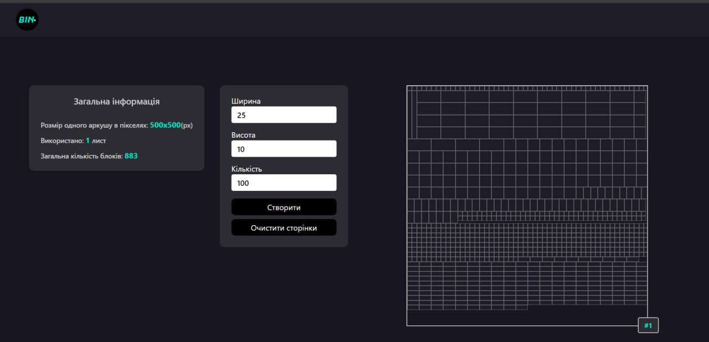

# BinPackager - Efficient Bin Packing Solution

Welcome to the BinPackager project! This application optimizes the packing of different sized blocks into sheets, ensuring minimal wastage and efficient space usage.

## Features

- **Efficient Bin Packing Algorithm**: Implements a binary tree bin packing algorithm for optimal space utilization.
- **Customizable Block and Sheet Sizes**: Users can define the sizes of blocks and sheets to fit their specific needs.
- **Interactive UI**: A user-friendly interface built with React.js for a seamless experience.

## Technologies Used

- **React.js**: For building a dynamic and responsive user interface.
- **Typescript**: Ensuring type safety and better code management.
- **SCSS**: For advanced styling of the application.
- **VITE**: for efficient and fast project assembly.

## Setup

Clone the repository and run the following command to start the development server:
[git clone https://github.com/Vergos1/pet-project_BinPackager.git](https://github.com/Vergos1/pet-project_BinPackager.git)

## Created by
Design and any crafted with 💜 by [Ihor Yanchuk](https://github.com/Vergos1). For more information or to view my other work, please visit [my portfolio](http://yanchuk.vinnytsia.ua/).